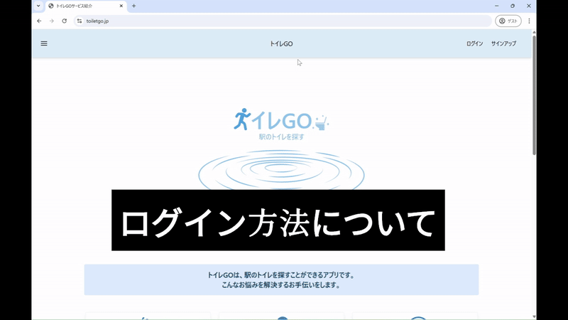

# トイレGO

## 1. アプリの概要  
本アプリは駅に併設されているトイレを探すアプリです。急に体調が悪くなった時、子どもから「トイレに行きたい」と求められた時、デート時の身だしなみチェックの時、そんな悩みの解決の一助となるアプリです。 
アプリでは駅を検索することで、駅のトイレを調べることができ、そのトイレにはどのような機能が付いているのか確認することができます。またユーザーは性別ごとのトイレを「きれいさ」、「広さ」、「空き具合」の観点で点数化し、そのトイレへレビューもでき、トイレを評価できます。

## 2. 使い方
### テストユーザー

|ユーザー名   |メールアドレス         |パスワード          |性別  |
|------------|----------------------|-------------------|----  |
|test1       |test1@test.com        |test1_p@ssword     |男性  |

・以下のURLにアクセスする。  
https://toiletgo.jp/

#### ユーザー認証操作

#### アプリ基本操作
##### トイレ検索
・その１
 
・その２

##### ランキングを見る
・その１
 
・その２

##### 最新のレビューを見る

##### LINEからのアプリ操作
・手順１
以下のQRコードを読み込みます。 
 

・手順２
 

## 3. 使用技術
* Python 3.12.3
* Javascript 18.19.1
* Django 5.1.6
* PostgreSQL
* Vultr(Ubuntu 24.04.04)
* Gunicorn
* Nginx
* LINE Front-end Framework(LIFF)
* LINE Messaging API

## 4. システム構成図  

## 5. ER図  

## 6. 機能一覧
* ユーザー登録(Django、LIFF)、ログイン機能(Django、LIFF)、ログアウト機能
* ユーザー削除
* ユーザー情報更新
* パスワード変更
* 検索機能
  * 設置トイレ検索
  * トイレランキング検索
  * 性別切り替え(設置トイレ検索結果、トイレランキング)
* レビュー機能
  * 評価(きれいさ、広さ、空き具合)、コメント投稿
  * 評価およびコメントの削除、修正
* ページネーション機能
  * ページ遷移
  * 無限スクロール
  * 表示件数拡大および縮小

## 7. 画面遷移図
* PC版
  * ユーザ認証  
  
  
  * アプリ遷移  
  

* スマートフォン版
  * ユーザ認証  
  

  * アプリ遷移  
  

## 8. 今後の課題および導入したい機能
* リアルタイム混雑状況確認機能
* トイレまでの案内図や各駅ごとのトイレマップの導入
* トイレの特徴ごとのタグ検索機能
* 問い合わせフォーム
* さらなる路線や駅のトイレを追加
